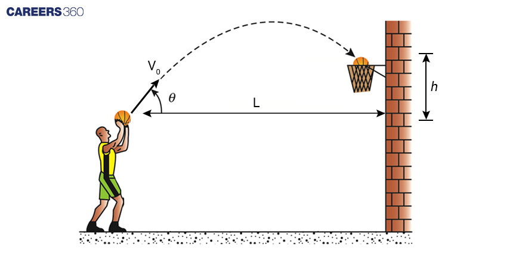
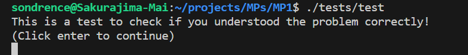
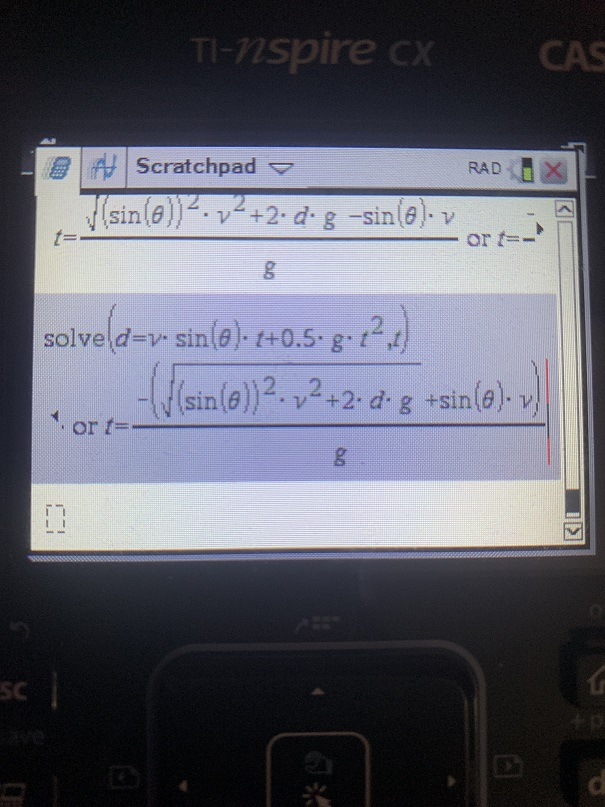

# MP #01 (Basic C)
In this MP (Machine Program) we will be going over a very basic structure of C and how to use it.

## (Part 1) The Problem:
Suppose we are shooting a basketball into a hoop and we need to know how far away we need to shoot the basketball in meters to get it into the hoop. Ignoring air resistance we can model this as a parabola with a gravity of $9.81m/s^2$ in the y direction. Let's also suppose our uncle is taller than us and so we must always shoot the basketball with an angle of $70^\circ$ to get the ball past him. We know we are 165cm tall so the origin of the ball wil be around 185cm off the ground (where a typical basketball hoop is 300cm off the ground). Given an input of a certain velocity $v_o$. Return the value $L$ which is the distance we need to be away.

## (Part 2) Take the test:
As you can see there is a file under ./MP1/tests/test. Please navigate to ~/{location of repo}/MPs/MP1 using the terminal at the bottom of VSCode. Using `cd ~/{location of repo}/MPs/MP1` (Make sure to change {location of repo} to the correct).

 (like so)

And now to take the test using `./tests/test`

 (like so)

Please score an 100% before moving on

## (Part 3) Write the code:
Let's suppose Bobby Cowhey asks us to compute a LOT of these basketball problems with a lot of different velocities. Instead of actually doing this by hand because it's annoying, let's write a program to do this.

The structure of what your code should look like is already given for you in `main.c`. Use this and check your answers with the key below.

### MAKE SURE YOUR UNITS YOU ARE USING THE CORRECT UNITS (meters, seconds, radians, etc)
If you are having touble calculating time use this equation below! (Given in question 5 of the test).
If you investigate this more clsely you can see this is the quadratic equation at play.

### To run the code you can use the run button, but because we want to learn to use the terminal use can use the following commands. (Make sure you are in the directory `~/{location of repo}/MPs/MP1` like before)
`gcc main.c -o main` (This will compile your file called `main.c` into a file called `main` [Compiling means you convert your C code into machine code!])

`./main` (This will run your file called main)

## Learn more: 
[Practice C Coding](https://www.w3schools.com/c/c_exercises.php)

[Compiling](https://medium.com/@laura.derohan/compiling-c-files-with-gcc-step-by-step-8e78318052)

[Kinematics](https://www.youtube.com/watch?v=P3jCdsWJa38&pp=ygUda2luZW1hdGljIGVxdWF0aW9ucyBleHBsYWluZWQ%3D)

[Math Library C](https://www.tutorialspoint.com/c_standard_library/math_h.htm)

